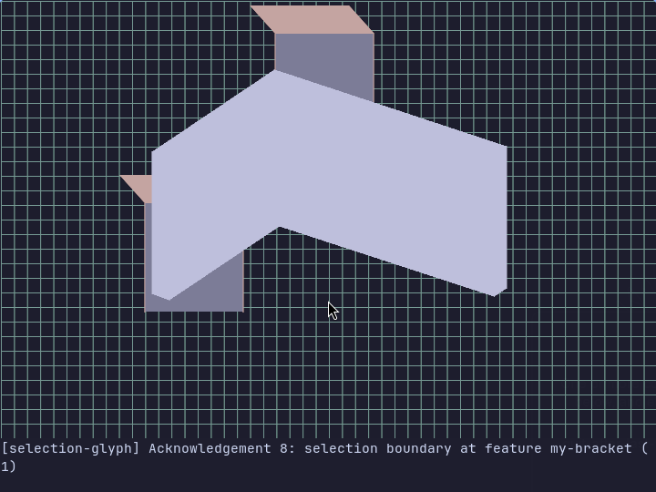
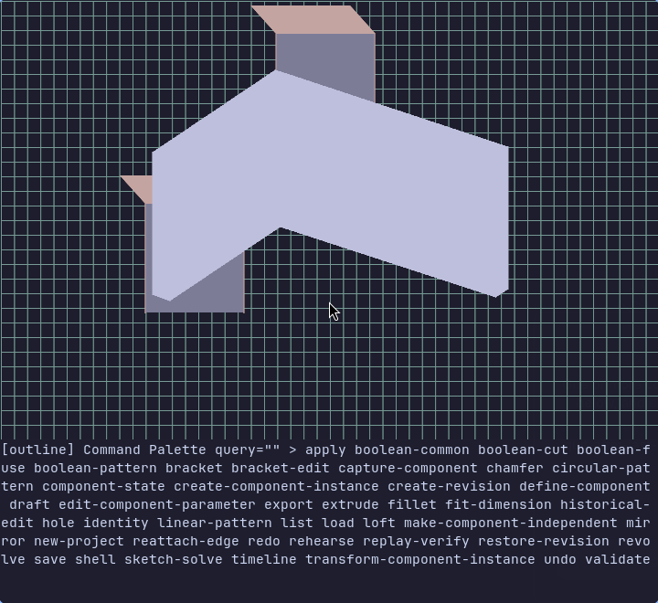
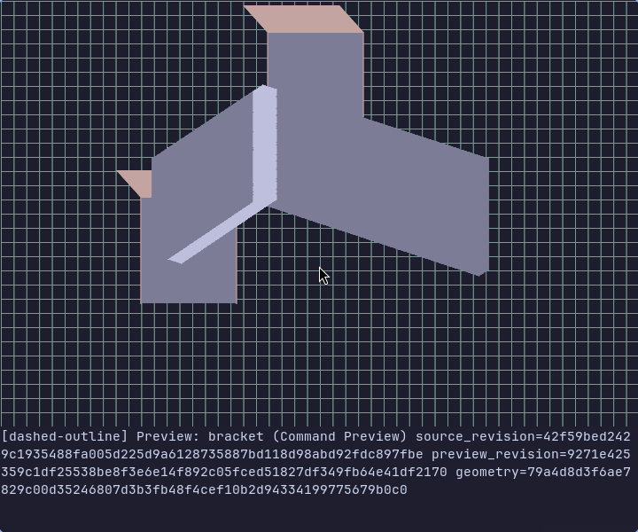

# ThreeTerm

**Design your next printed part without leaving the terminal.**

ThreeTerm is a Linux, keyboard-first parametric CAD tool for functional 3D-printed
parts: brackets, spacers, collars, and small enclosures. It renders solid geometry
inside Ghostty, lets you preview a modeling operation before committing it, and
exports files for your usual slicer.

[Website](https://rafaelromao.github.io/threeterm/) ·
[Install](#install) · [Make your first part](#make-your-first-part) ·
[Keyboard controls](#keyboard-controls)



*Compact production viewport/status capture with real geometry and scripted input;
[capture details](docs/assets/screenshots/README.md).*

## Is it for you?

If you like TUIs, explicit dimensions, and repeatable commands, ThreeTerm gives
you a terminal-native way to build a part and inspect it in 3D.

**This is an early MVP.** Modeling commands currently take **JSON input** in a
command palette. Expect to type coordinates and feature IDs rather than fill out
graphical forms. The interactive environment is a **direct, local Ghostty window
on Linux**; tmux and SSH attachments are rejected. The verified version is
**Ghostty `1.3.1-arch2`**. Startup probes actual terminal capabilities too, so a
matching terminal name alone is not enough.

### What you can do today

| Job | Interactive commands |
| --- | --- |
| Start with a simple solid | `bracket`, additive/subtractive `extrude`, `revolve` |
| Join parts | `boolean-fuse` |
| Finish a part | `fillet`, `chamfer`, `hole`, `shell`, `draft`, `loft` |
| Repeat geometry | `mirror`, `linear-pattern`, `circular-pattern` |
| Solve a dimensioned sketch | `sketch-solve` with explicit entities and constraints |
| Keep and reopen your work | `new-project`, `save`, `load` |
| Prepare a file for printing or CAD exchange | `validate`, `export` to STL, 3MF, or STEP |

The viewport supports feature selection, orbit, pan, and zoom. Five built-in
palettes are available. Project changes are recorded in a durable transaction
log with integrity-checked generations and bounded recovery.

The CLI also exposes operations such as boolean cut/common, history edits,
undo/redo, fit dimensions, and reusable components. A command appearing in the
shared registry does **not** guarantee that the current TUI can execute it; some
palette entries are discovery-only. There are no documented TUI undo/redo
shortcuts in this version.

ThreeTerm creates geometry and exports it. Use your existing slicer to choose
orientation, supports, infill, and printer settings and generate G-code.

## Install

### Quick install: Arch Linux, x86_64

You need a desktop session, Bash, curl, tar, and permission to install packages.
Authenticate sudo in your terminal first, then run:

```sh
sudo -v
curl -fsSL https://raw.githubusercontent.com/rafaelromao/threeterm/main/install.sh | bash
```

This is a **source build**, not a prebuilt binary download. It installs system
dependencies with `pacman -Syu`, including Ghostty, installs the pinned Rust
toolchain through rustup, builds pinned OCCT and libslvs sources, and installs
the three application commands plus both native workers and their libraries.
`pacman -Syu` performs a full system upgrade. The build can take a substantial
amount of time and several GB of free space, especially on the first run.

The default destination is `~/.local`. Add its commands to your shell's PATH if
needed:

```sh
export PATH="$HOME/.local/bin:$PATH"
```

Put that line in your shell's startup file to keep it across sessions. Open
Ghostty and launch the interactive tool there. The installer uses the repository
version of Ghostty; the currently verified application environment remains
`1.3.1-arch2`.

### Install from a checkout

Git and make must be available before these commands. On Arch, install them with
`sudo pacman -Syu --needed git make` if needed.

```sh
git clone https://github.com/rafaelromao/threeterm.git
cd threeterm
sudo -v
make install
```

Both install methods use the same installer. Options:

```sh
# Build with four parallel jobs and a different user-owned prefix.
make install JOBS=4 PREFIX="$HOME/apps/threeterm"

# System dependencies already present? Skip package management.
make install INSTALL_FLAGS=--no-system-packages

# The curl bootstrap accepts the same options.
curl -fsSL https://raw.githubusercontent.com/rafaelromao/threeterm/main/install.sh \
  | bash -s -- --jobs 4 --prefix "$HOME/apps/threeterm"
```

`THREETERM_REF` selects the bootstrap's source branch, tag, or commit (default:
`main`). `THREETERM_CACHE_DIR` changes its download cache (default:
`${XDG_CACHE_HOME:-~/.cache}/threeterm`). `THREETERM_BUILD_ROOT` changes the reusable
build directory; checkout installs use `target/install` by default. Re-running
the installer reuses completed native dependency builds.

### Dependencies

Automatic system package setup targets **Arch Linux on x86_64**. On other x86_64
Linux distributions, install the system dependencies yourself and use
`--no-system-packages`; those environments are not qualified by the interactive
test suite.

| Dependency | Purpose | How it is installed |
| --- | --- | --- |
| Ghostty | Terminal graphics and keyboard/mouse input for the TUI | Arch `ghostty`; qualified version `1.3.1-arch2` |
| Bash, coreutils, tar, util-linux, glibc, C/C++ runtime | Installer, launchers, `stty`, process execution, and native shared libraries | Arch base system plus `base-devel` |
| GCC/G++, make, CMake | Build the two native CAD workers and their dependencies | Arch `base-devel cmake` |
| Git, curl, CA certificates | Download pinned source and Rust | Arch `git curl` and their dependencies |
| jq | Installer metadata and optional command-schema inspection | Arch `jq` |
| FreeType, Fontconfig, X11 development files | Native source-build dependencies | Arch `freetype2 fontconfig libx11` |
| Rust **1.97.1** and Cargo | Compile ThreeTerm | rustup, pinned by `rust-toolchain-channel.txt` |
| Open CASCADE / OCCT **7.9.2** | Construct, validate, render, and export solids | Built from commit `c5f20409c52bf8f658314d205a0e5d6f0be0969c` |
| SolveSpace **3.2** / libslvs | Solve sketch constraints | Built from commit `27b6a080c8b669421bd4d444650c3b8eddec5687`, including submodules |
| Lua | Embedded scripting support used by the application | Compiled through Cargo's vendored Lua dependency; no system Lua needed |

OCCT and libslvs libraries are bundled under `<prefix>/lib/threeterm`; the
installed launchers configure their worker and library paths. You can remove the
source/build cache after a successful install. Rust, Git, and CMake are needed
for rebuilding, not for day-to-day modeling. A slicer is a separate tool and is
not installed by ThreeTerm.

Weston, screenshot/OCR tools, and the repository's graphical test harness are
development dependencies, not requirements for ordinary modeling.

## Make your first part

This example makes a **40 × 20 × 30 mm L-bracket with 3 mm walls**, then exports
an STL. Dimensions use millimetres. Run these shell commands in a direct local
Ghostty window with a UTF-8 locale:

```sh
threeterm new-project "$HOME/first-bracket.threeterm"
threeterm-tui "$HOME/first-bracket.threeterm"
```

The project is a **directory bundle**, even though its name ends in `.threeterm`.
Choose a new, unused path for `new-project`.

### 1. Create the bracket

Press **Ctrl+P**, type `bracket`, and press **Enter**. Type the following as one
line in the command draft:

```json
{"bracket_id":"my-bracket","length":40,"width":20,"height":30,"thickness":3}
```

Press **Ctrl+V** to preview. Once the preview is ready, press **Ctrl+Enter** to
commit. **Escape** cancels a draft or preview. The TUI supplies the active project
path and revision automatically.

You can also start from a rectangular profile with `extrude`, for example:

```json
{"feature_id":"spacer","profile":[[0,0],[20,0],[20,10],[0,10]],"height":3,"mode":"additive"}
```

### 2. Inspect and validate

Use the arrow keys to select features and orbit the view, `W/A/S/D` or
`H/J/K/L` to pan, and `+` / `-` to zoom.

Open the palette again, select `validate`, and enter:

```json
{"feature_id":"my-bracket"}
```

Preview with **Ctrl+V**, then commit with **Ctrl+Enter**. The TUI requires
successful validation of the **same feature at the current revision** before
export. A subsequent modeling change means you must validate again.

### 3. Export for your slicer

Choose `export` in the palette and enter:

```json
{"feature_id":"my-bracket","formats":["stl"],"output_dir":"./prints","tessellation_deflection":0.1,"override_warnings":false,"accept_stale_geometry":false}
```

Preview, then commit. The STL is written under `./prints`, relative to the
directory from which you launched ThreeTerm. Open it in your slicer and check
dimensions and print orientation. Lower tessellation deflection gives a finer
mesh, which can be useful for curved parts.

Committed modeling commands persist the project. Quit with **q** when no command
draft is active, then reopen with the same `threeterm-tui` command. Back up the
whole bundle directory if you want to preserve editable work; an STL alone does
not retain modeling history.

## Keyboard controls

| Input | Action |
| --- | --- |
| **Ctrl+P** | Open the command palette |
| Text / **Backspace** | Search the palette or edit the JSON draft |
| **Arrows** in the palette | Move between matching commands |
| **Enter** in the palette | Open the selected command's draft |
| **Ctrl+V** | Preview the current draft |
| **Ctrl+Enter** | Commit a ready preview; if no preview exists, request one first |
| **Escape** | Dismiss the palette or cancel the draft/preview |
| **Arrows** in the viewport | Navigate feature selection and orbit |
| **W/A/S/D** | Pan up/left/down/right |
| **H/J/K/L** | Pan left/down/up/right |
| **+** / **=**, **-** / **_** | Zoom in/out |
| Left click | Pick viewport geometry when command input is inactive |
| **q** or **Ctrl+C**, with no command input active | Quit and restore the terminal |

The current draft editor appends characters and supports Backspace. It is not a
full text editor: Enter does not submit JSON, and arrow keys do not move a text
cursor. Type JSON on one line; multiline/bracketed paste is not a supported
editing workflow.

## Themes

```sh
THREETERM_PALETTE=gruvbox threeterm-tui "$HOME/first-bracket.threeterm"
```

Available names: `catppuccin` (default), `tokyo-night`, `evergreen`, `gruvbox`, and
`sandman-light`.

## Screenshots



*Choose a command with Ctrl+P, search, then Enter.*



*Preview the geometry before committing. See [capture details](docs/assets/screenshots/README.md).*

## When something goes wrong

- **Viewport will not start:** use a local Ghostty window, outside tmux and SSH,
  with a UTF-8 locale. Startup returns a structured diagnostic on stderr when
  identity, transport, or positively observed capabilities are missing. The
  current startup probe requires keyboard, mouse, focus, and resize observations;
  even a supported Ghostty build can fail if those observations are absent.
- **Invalid JSON or rejected preview:** correct the draft's inputs, then preview
  again. Use **Escape** to discard it. Previewing does not change the project.
- **Export is blocked:** validate the chosen feature again after your last edit.
  Stale last-valid geometry does not count as a current validated solid.
- **Install fails:** check free disk space, network access, and the compiler/CMake
  output. For automatic package setup, run `sudo -v` first. The installer fails
  if either native worker cannot complete its handshake.
- **`threeterm` does not show a viewport:** that command is the JSON-output CLI.
  Start **`threeterm-tui`** for interactive modeling.

For scripts and integrations, `threeterm --machine list` returns the registered
command schemas. With jq, inspect a specific command using:

```sh
threeterm --machine list | jq '.[] | select(.name == "extrude") | .request_schema'
```

`threeterm-mcp` provides the same command API to MCP clients over stdio. Neither
the CLI nor MCP supplies the interactive viewport.

### A bracket from shell commands

The same simple part can be built and exported headlessly. These commands also
give you a way to check the native geometry installation when troubleshooting
interactive startup:

```sh
threeterm new-project "$HOME/cli-bracket.threeterm"
threeterm --machine bracket "$HOME/cli-bracket.threeterm" \
  --bracket-id my-bracket --length 40 --width 20 --height 30 --thickness 3
threeterm --machine export --bundle "$HOME/cli-bracket.threeterm" \
  --feature-id my-bracket --formats stl --output-dir ./prints \
  --tessellation-deflection 0.1
```

Each command writes a JSON response. Export performs its geometry checks; the
TUI's separate visible-validation requirement applies to the interactive workflow.

## Uninstall

From a checkout:

```sh
make uninstall
# Match the prefix if you installed somewhere else:
make uninstall PREFIX="$HOME/apps/threeterm"
```

For a curl installation, run `scripts/install-local.sh --uninstall` from its
retained source directory, with `--prefix` if you changed it. Uninstall removes
the ThreeTerm commands and runtime bundle. It retains projects, system packages,
Rust, and build caches.

## More information

- [Development and verification guide](docs/development.md)
- [Implementation specification](docs/mvp-implementation-specification.md)
- [Website and GitHub Pages setup](docs/website.md)
- [Report a problem](https://github.com/rafaelromao/threeterm/issues)

ThreeTerm's first-party code is MIT/Apache-2.0 except for the GPL-3.0-only libslvs
worker. OCCT uses LGPL-2.1 with its additional exception. See [LICENSE](LICENSE),
[libslvs policy](licenses/libslvs.json), and the worker notices for details.
